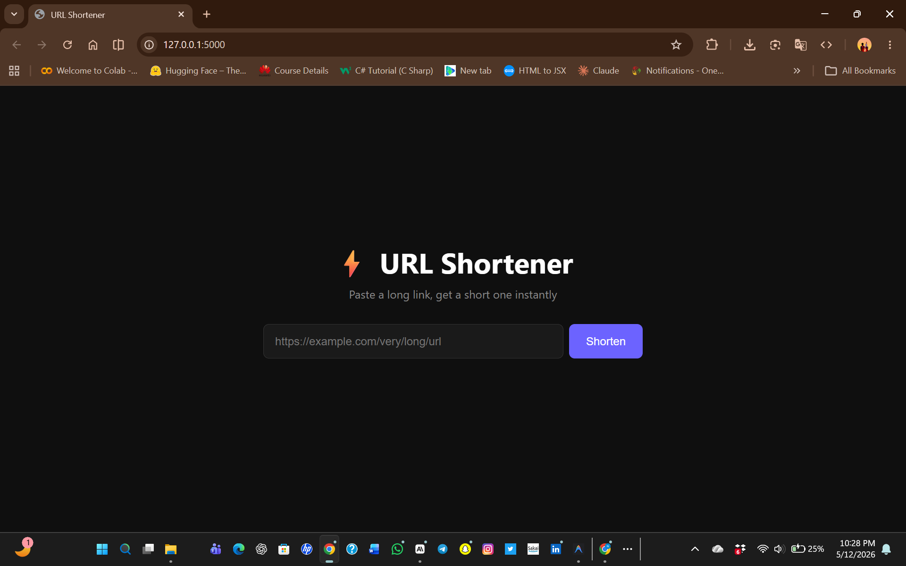

# ⚡ URL Shortener

<div align="center">


</div>

---

## 🌍 Overview

**URL Shortener** is a sleek and modern full-stack web application that allows users to instantly shorten long URLs into clean, shareable links.

Built with **Python** and **Flask**, the app also tracks link analytics such as click counts while delivering a smooth dark-mode user experience.

---

## ✨ Features

✅ Instantly shorten long URLs
✅ Redirect users using generated short links
✅ Track the number of clicks for every URL
✅ Clean and responsive dark-mode interface
✅ Lightweight and fast backend with Flask
✅ SQLite database integration
✅ Easy local setup and deployment

---

## 📸 Preview

<div align="center">



</div>

---

# 🛠️ Tech Stack

| Technology                                                                                                              | Description                      |
| ----------------------------------------------------------------------------------------------------------------------- | -------------------------------- |
|                    | Backend programming language     |
|                       | Lightweight Python web framework |
|  | ORM for database management      |
|                    | Database                         |
|                       | Frontend structure               |
|                          | Styling                          |
|        | Frontend interactivity           |

---

# 📂 Project Structure

```bash
url-shortener/
│
├── static/
│   ├── css/
│   ├── js/
│
├── templates/
│
├── screenshot.png
├── app.py
├── requirements.txt
├── README.md
└── database.db
```

---

# ⚙️ Installation & Setup

## 1️⃣ Clone the Repository

```bash
git clone https://github.com/yawasante-dev/url-shortener.git
cd url-shortener
```

---

## 2️⃣ Create a Virtual Environment

### Windows

```bash
python -m venv venv
venv\Scripts\activate
```

### macOS / Linux

```bash
python3 -m venv venv
source venv/bin/activate
```

---

## 3️⃣ Install Dependencies

```bash
pip install -r requirements.txt
```

---

## 4️⃣ Run the Application

```bash
python app.py
```

---

## 5️⃣ Open in Browser

Visit:

```bash
http://127.0.0.1:5000
```

---

# 🔗 How It Works

1. Paste a long URL into the input field
2. Click the **Shorten** button
3. Receive a shortened URL instantly
4. Share the short link anywhere
5. The app tracks every click automatically

---

# 🚀 Future Improvements

* User authentication system
* Custom short aliases
* QR code generation
* Link expiration feature
* Advanced analytics dashboard
* Cloud database support

---

# 🤝 Contributing

Contributions are welcome!

If you'd like to improve the project:

1. Fork the repository
2. Create a new branch
3. Commit your changes
4. Push to your branch
5. Open a Pull Request

---

# 📜 License

This project is licensed under the **MIT License**.

---

# 👨‍💻 Author

### Asante

[](https://github.com/yawasante-dev)

---

<div align="center">

### ⭐ If you like this project, give it a star on GitHub!

</div>
